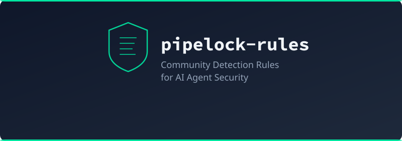

<p align="center">
  
</p>

<p align="center">
  <a href="LICENSE"></a>
  <a href="https://github.com/luckyPipewrench/pipelock"></a>
</p>

Detection rule bundles for [Pipelock](https://github.com/luckyPipewrench/pipelock), the open-source agent firewall.

Pipelock ships with built-in DLP, injection, and tool-poison scanners. Rule bundles extend those defaults with additional patterns that ship on a faster cadence than the core binary. Bundles are Ed25519-signed, versioned, and additive (they never override built-in rules).

## How Bundles Work

A **rule bundle** is a signed YAML file containing detection rules. Pipelock loads bundles at startup and merges them with its built-in patterns.

```
┌──────────────────────────────────────────────────────┐
│                    pipelock scanner                   │
│                                                      │
│  Built-in patterns     +   Rule bundles (additive)   │
│  ├── 70+ DLP regexes       ├── pipelock-community    │
│  ├── injection detection   ├── acme-corp-internal    │
│  └── tool-poison checks    └── your-bundle-here      │
│                                                      │
└──────────────────────────────────────────────────────┘
```

Anyone can create a bundle. Security teams build internal bundles for company-specific credentials. Researchers publish bundles for new attack patterns. Each bundle is independently signed and versioned.

```bash
# Install the official community bundle
pipelock rules install pipelock-community

# Install a third-party bundle from a URL
pipelock rules install --source https://example.com/bundles/acme-rules acme-rules

# Install from a local path (for development)
pipelock rules install --path ./my-bundle/ --allow-unsigned

# List what's installed
pipelock rules list
```

## The Community Bundle

This repo contains **pipelock-community**, the official community bundle. It ships 28 detection rules across three categories:

| Category | Stable | Experimental | Examples |
|----------|--------|--------------|----------|
| **DLP** | 7 | 4 | Perplexity, 1Password, Vercel, Buildkite, Pulumi, Doppler, Shopify, Modal |
| **Injection** | 6 | 4 | HTML comment hiding, system tag override, delimiter breakout, exfil imperative, multilingual (ES/FR/DE/ZH) |
| **Tool-Poison** | 5 | 2 | Concealment, precall harvest, cross-tool replacement, exfil URL, prompt harvest, binary mimicry |

**Stable** rules (18) have true-positive and false-positive fixtures, plus primary source citations.
**Experimental** rules (10) have true-positive fixtures only. They may have higher false positive rates and are disabled by default.

```bash
pipelock rules install pipelock-community
```

Enable experimental rules in your config:

```yaml
rules:
  include_experimental: true
```

## Creating Your Own Bundle

A bundle is a signed YAML file with a header and a list of rules. Three rule types are supported:

| Type | `type` value | What it detects |
|------|-------------|-----------------|
| DLP | `dlp` | Credentials and secrets in outbound traffic |
| Injection | `injection` | Prompt injection in fetched content and tool responses |
| Tool-poison | `tool-poison` | Hidden instructions in MCP tool descriptions |

Bundles are Ed25519-signed and versioned. Official bundles are verified against the keyring embedded in pipelock release binaries. Third-party bundles are verified against keys in the user's `trusted_keys` config.

See the [full bundle authoring guide](https://github.com/luckyPipewrench/pipelock/blob/main/docs/rules.md#creating-your-own-bundle) for the YAML schema, signing, distribution, and trust model.

## Development

```bash
# Compile individual rule files into a single bundle
make compile

# Validate the bundle with pipelock
make validate

# Run fixture tests (every regex against its true/false positive fixtures)
make test-fixtures
```

### Repository layout

```
rules/
  dlp/              One YAML file per DLP pattern
  injection/        One YAML file per injection pattern
  tool-poison/      One YAML file per tool-poison pattern
fixtures/
  dlp/              True/false positive test strings
  injection/
  tool-poison/
published/
  pipelock-community/
    bundle.yaml     Compiled bundle (all rules merged)
    bundle.yaml.sig Ed25519 signature
scripts/
  compile.sh        Merges rule files into bundle.yaml
  test-fixtures.sh  Validates every regex against fixtures
```

## Contributing

See [CONTRIBUTING.md](CONTRIBUTING.md) for how to add a new rule. Every rule needs:

- An RE2-compatible regex
- At least one true-positive fixture
- A primary source citation (stable rules)
- At least one false-positive fixture (stable rules)

## License

Apache 2.0. See [LICENSE](LICENSE).
