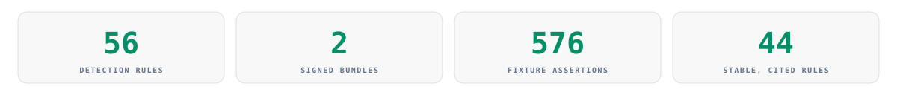
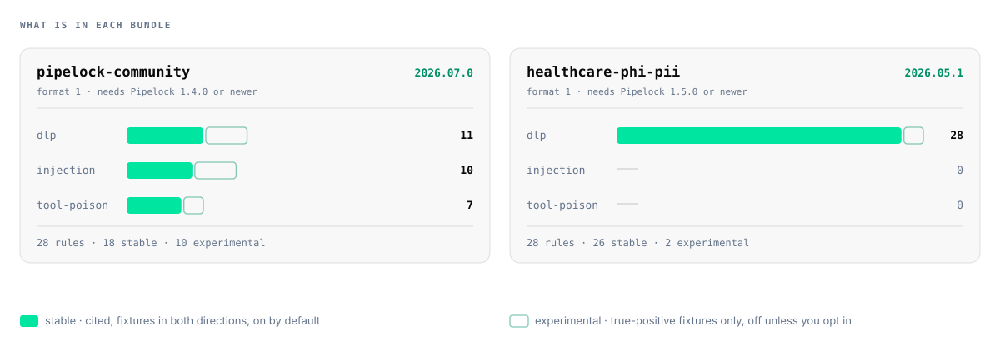
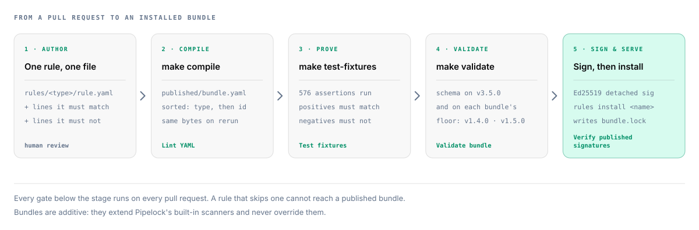
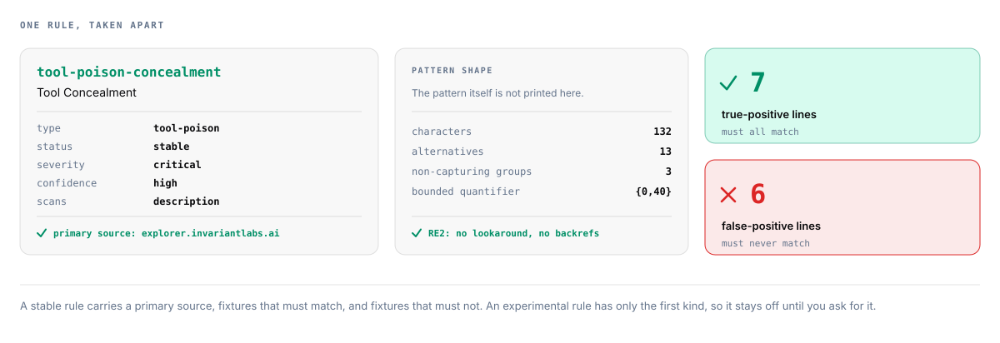
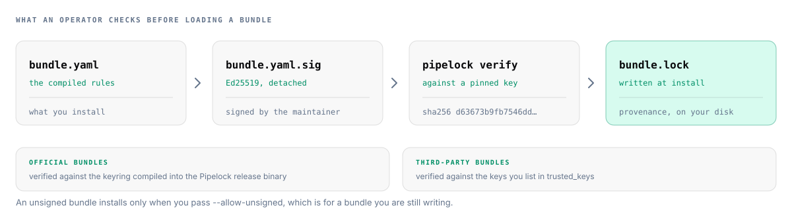

<h1 align="center">pipelock-rules</h1>

<p align="center">
  Signed, versioned detection rules for <a href="https://github.com/luckyPipewrench/pipelock">Pipelock</a>, the open-source agent firewall.
</p>

<p align="center">
  <a href="https://github.com/luckyPipewrench/pipelock-rules/actions/workflows/ci.yaml"></a>
  <a href="https://github.com/luckyPipewrench/pipelock"></a>
  <a href="LICENSE"></a>
  <a href="https://discord.gg/badNfhGKTc"></a>
</p>

Pipelock ships with built-in DLP, injection, and tool-poison scanners. Rule bundles extend those defaults with patterns that ship on a faster cadence than the core binary. Bundles are Ed25519-signed, versioned, and additive: they add detections and never override or weaken a built-in one.

<picture>
  <source media="(prefers-color-scheme: dark)" srcset="assets/diagram-stats-strip-dark.svg">
  
</picture>

## Install

Any published bundle installs by name from the Pipelock registry at `https://pipelab.org/rules/`:

```bash
pipelock rules install <bundle>
```

Published so far:

```bash
pipelock rules install pipelock-community
pipelock rules install healthcare-phi-pii
```

That is the whole install. Pipelock verifies the signature against the keyring compiled into its release binary before the bundle loads, so there is nothing further to check by hand.

<details>
<summary><b>Installing from a GitHub Release instead, verifying the signature yourself</b></summary>

<br>

Release assets are an alternate HTTPS source for anyone who would rather not depend on the registry, or who wants to check the signature independently before installing.

Each asset is prefixed with its bundle name, because a GitHub Release cannot hold two files called `bundle.yaml`. Repository releases use plain `v*` tags for packaging; each bundle keeps its own CalVer version, so a repository tag neither replaces nor synchronizes bundle versions.

Download the bundle, its detached signature, and the checksum file:

```bash
base=https://github.com/luckyPipewrench/pipelock-rules/releases/latest/download
curl -fsSLO "$base/pipelock-community-bundle.yaml"
curl -fsSLO "$base/pipelock-community-bundle.yaml.sig"
curl -fsSLO "$base/SHA256SUMS"
grep -E '  \./pipelock-community-bundle\.yaml(\.sig)?$' SHA256SUMS | sha256sum -c -
```

Fetch the official public key and confirm it is the one this repository publishes:

```bash
mkdir -p verify/agents/pipelock-official
curl -fsSLo verify/agents/pipelock-official/id_ed25519.pub \
  https://raw.githubusercontent.com/luckyPipewrench/pipelock-rules/main/.github/rules-official/pipelock-official.pub
printf '%s  %s\n' d63673b9fb7546dd5f223dc8df3b39a51eb8298d914fc602ba75c5d22910dd9f \
  verify/agents/pipelock-official/id_ed25519.pub | sha256sum -c -
```

Check the signature, then install from the same URL:

```bash
pipelock verify pipelock-community-bundle.yaml \
  --sig pipelock-community-bundle.yaml.sig \
  --keystore verify --agent pipelock-official

pipelock rules install --source "$base/pipelock-community-bundle.yaml" pipelock-community
```

`--source` takes any HTTPS URL. For a bundle you are still writing, use `--path` instead.

</details>

## What's in each bundle

<picture>
  <source media="(prefers-color-scheme: dark)" srcset="assets/diagram-coverage-dark.svg">
  
</picture>

**pipelock-community** is the official community bundle: credential patterns for providers Pipelock does not cover by default, such as 1Password, Doppler, Pulumi, Shopify, and Vercel; prompt-injection techniques including non-English overrides; and MCP tool-description poisoning.

**healthcare-phi-pii** is a healthcare DLP bundle contributed by BGASoft, Inc. It covers the regex-detectable entries from HIPAA Safe Harbor's 18 identifiers, financial PII, and clinical laboratory identifiers.

Every rule, with what it detects, its severity, and its primary source, is listed in the [rule catalog](docs/rule-catalog.md). That page is generated from the compiled bundles, so it cannot fall behind them.

Stable rules are enabled by default. Experimental rules are not, because they carry only true-positive fixtures and may fire on traffic you consider benign. Turn them on when you want the wider net:

```yaml
rules:
  include_experimental: true
```

## How a rule gets in

<picture>
  <source media="(prefers-color-scheme: dark)" srcset="assets/diagram-pipeline-dark.svg">
  
</picture>

The point of the pipeline is that a rule's claims are executable. A regex that matches nothing, or that matches ordinary traffic, fails before review ever sees it.

## Anatomy of a rule

<picture>
  <source media="(prefers-color-scheme: dark)" srcset="assets/diagram-anatomy-dark.svg">
  
</picture>

A rule is a small YAML file: an identifier, what it detects, how severe a match is, the field it reads, and an RE2-compatible pattern. Next to it live the fixtures, one test string per line, that decide whether it is allowed to ship.

## Trust

<picture>
  <source media="(prefers-color-scheme: dark)" srcset="assets/diagram-trust-dark.svg">
  
</picture>

Official bundles are verified against the keyring compiled into Pipelock release binaries. Third-party bundles are verified against keys you list in `trusted_keys`. Installing writes a `bundle.lock` recording what you actually got.

## Creating your own bundle

Anyone can publish a bundle. Security teams write internal ones for company-specific credentials; researchers publish them for new attack patterns. Three rule types are supported:

| Type | `type` value | What it detects |
|------|-------------|-----------------|
| DLP | `dlp` | Credentials and secrets in outbound traffic |
| Injection | `injection` | Prompt injection in fetched content and tool responses |
| Tool-poison | `tool-poison` | Hidden instructions in MCP tool descriptions |

```bash
# Install a third-party bundle from an HTTPS URL
pipelock rules install --source https://example.com/bundles/acme-rules/bundle.yaml acme-rules

# Install from a local path while you are still writing it
pipelock rules install --path ./my-bundle/ --allow-unsigned

# List what's installed
pipelock rules list
```

See the [full bundle authoring guide](https://github.com/luckyPipewrench/pipelock/blob/main/docs/rules.md#creating-your-own-bundle) for the YAML schema, signing, distribution, and trust model.

## Development

```bash
# Compile individual rule files into a single bundle
make compile

# Compile a specific bundle
BUNDLE_NAME=healthcare-phi-pii make compile

# Validate the compiled bundle against the Pipelock schema
make validate

# Run every regex against its true and false positive fixtures
make test-fixtures

# Re-render the README diagrams from the live bundles
make diagrams

# Everything CI runs locally, for every published bundle
make preflight
```

`make preflight` requires a Pipelock CLI on your PATH. It never downloads one, so a missing binary is a clear prerequisite failure rather than a silently skipped schema check.

### Repository layout

```
rules/<bundle>/<type>/       One YAML file per rule
fixtures/<bundle>/<type>/    Lines that must match, and lines that must not
published/<bundle>/          The compiled bundle.yaml and its detached .sig
assets/                      README diagrams, generated by scripts/render_diagrams.py
scripts/compile.sh           Merges rule files into bundle.yaml
scripts/test-fixtures.sh     Runs every regex against its fixtures
```

## Learn more

- [What is an Agent Firewall?](https://pipelab.org/agent-firewall/): how Pipelock scans agent traffic
- [Community Rules](https://pipelab.org/learn/community-rules/): install guide and rule documentation
- [MCP Tool Poisoning](https://pipelab.org/learn/mcp-tool-poisoning/): why tool-poison rules exist
- [Pipelock on GitHub](https://github.com/luckyPipewrench/pipelock)

## Contributing

See [CONTRIBUTING.md](CONTRIBUTING.md) for how to add a rule. Every rule needs:

- An RE2-compatible regex (no lookahead, no backreferences)
- At least one true-positive fixture
- A primary source citation (stable rules)
- At least one false-positive fixture (stable rules)

## License

Apache 2.0. See [LICENSE](LICENSE).
