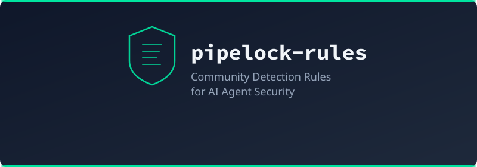

<p align="center">
  
</p>

<p align="center">
  <a href="LICENSE"></a>
  <a href="https://github.com/luckyPipewrench/pipelock"></a>
  <a href="https://discord.gg/badNfhGKTc"></a>
</p>

Detection rule bundles for [Pipelock](https://github.com/luckyPipewrench/pipelock), the open-source agent firewall.

Pipelock ships with built-in DLP, injection, and tool-poison scanners. Rule bundles extend those defaults with additional patterns that ship on a faster cadence than the core binary. Bundles are Ed25519-signed, versioned, and additive (they never override built-in rules).

## Install

Install either official bundle from the Pipelock registry at `https://pipelab.org/rules/`:

```bash
pipelock rules install pipelock-community
pipelock rules install healthcare-phi-pii
```

GitHub Release assets provide an alternate HTTPS source. Repository releases use plain `v*` tags for packaging and repository tooling. Each bundle keeps its own CalVer version, so a repository tag doesn't replace or synchronize bundle versions.

The release workflow prefixes each asset with its bundle name because a GitHub Release can't contain two files named `bundle.yaml`. This example downloads the community bundle, checks both files against `SHA256SUMS`, verifies the detached Ed25519 signature with the repository's pinned public key, and installs from the same release asset URL:

```bash
curl -fsSLO https://github.com/luckyPipewrench/pipelock-rules/releases/latest/download/pipelock-community-bundle.yaml
curl -fsSLO https://github.com/luckyPipewrench/pipelock-rules/releases/latest/download/pipelock-community-bundle.yaml.sig
curl -fsSLO https://github.com/luckyPipewrench/pipelock-rules/releases/latest/download/SHA256SUMS
grep -E '  \./pipelock-community-bundle\.yaml(\.sig)?$' SHA256SUMS | sha256sum -c -

mkdir -p pipelock-rules-verify/agents/pipelock-official
curl -fsSLo pipelock-rules-verify/agents/pipelock-official/id_ed25519.pub https://raw.githubusercontent.com/luckyPipewrench/pipelock-rules/main/.github/rules-official/pipelock-official.pub
printf '%s  %s\n' d63673b9fb7546dd5f223dc8df3b39a51eb8298d914fc602ba75c5d22910dd9f pipelock-rules-verify/agents/pipelock-official/id_ed25519.pub | sha256sum -c -
pipelock verify pipelock-community-bundle.yaml --sig pipelock-community-bundle.yaml.sig --keystore pipelock-rules-verify --agent pipelock-official

pipelock rules install --source https://github.com/luckyPipewrench/pipelock-rules/releases/latest/download/pipelock-community-bundle.yaml pipelock-community
```

`--source` accepts an HTTPS URL. For local development bundles, use the separate `--path` form shown below.

## How Bundles Work

A **rule bundle** is a signed YAML file containing detection rules. Pipelock loads bundles at startup and merges them with its built-in patterns.

```
┌──────────────────────────────────────────────────────┐
│                    pipelock scanner                   │
│                                                      │
│  Built-in patterns     +   Rule bundles (additive)   │
│  ├── 65 DLP patterns       ├── pipelock-community    │
│  ├── injection detection   ├── acme-corp-internal    │
│  └── tool-poison checks    └── your-bundle-here      │
│                                                      │
└──────────────────────────────────────────────────────┘
```

Anyone can create a bundle. Security teams build internal bundles for company-specific credentials. Researchers publish bundles for new attack patterns. Each bundle is independently signed and versioned.

```bash
# Install a third-party bundle from an HTTPS URL
pipelock rules install --source https://example.com/bundles/acme-rules/bundle.yaml acme-rules

# Install from a local path for development
pipelock rules install --path ./my-bundle/ --allow-unsigned

# List what's installed
pipelock rules list
```

## The Community Bundle

This repo contains **pipelock-community**, the official community bundle. It ships 28 detection rules across three categories:

| Category | Stable | Experimental | Examples |
|----------|--------|--------------|----------|
| **DLP** | 7 | 4 | Perplexity, 1Password, Vercel, Buildkite, Pulumi, Doppler, Shopify, Modal |
| **Injection** | 6 | 4 | HTML comment hiding, system tag override, delimiter breakout, exfil imperative, multilingual (ES/FR/DE/ZH) |
| **Tool-Poison** | 5 | 2 | Concealment, precall harvest, cross-tool replacement, exfil URL, prompt harvest, binary mimicry |

**Stable** rules (18) have true-positive and false-positive fixtures, plus primary source citations.
**Experimental** rules (10) have true-positive fixtures only. They may have higher false positive rates and are disabled by default.

```bash
pipelock rules install pipelock-community
```

## Healthcare PHI/PII Bundle

This repo also contains **healthcare-phi-pii**, a healthcare-focused DLP bundle contributed by BGASoft, Inc. It ships 28 PHI/PII detection rules covering regex-detectable entries from HIPAA Safe Harbor's 18 identifiers, financial PII, and clinical laboratory identifiers.

```bash
pipelock rules install healthcare-phi-pii
```

Enable experimental rules in your config:

```yaml
rules:
  include_experimental: true
```

## Creating Your Own Bundle

A bundle is a signed YAML file with a header and a list of rules. Three rule types are supported:

| Type | `type` value | What it detects |
|------|-------------|-----------------|
| DLP | `dlp` | Credentials and secrets in outbound traffic |
| Injection | `injection` | Prompt injection in fetched content and tool responses |
| Tool-poison | `tool-poison` | Hidden instructions in MCP tool descriptions |

Bundles are Ed25519-signed and versioned. Official bundles are verified against the keyring embedded in pipelock release binaries. Third-party bundles are verified against keys in the user's `trusted_keys` config.

See the [full bundle authoring guide](https://github.com/luckyPipewrench/pipelock/blob/main/docs/rules.md#creating-your-own-bundle) for the YAML schema, signing, distribution, and trust model.

## Development

```bash
# Compile individual rule files into a single bundle
make compile

# Compile a specific bundle
BUNDLE_NAME=healthcare-phi-pii make compile

# Validate the bundle with pipelock
make validate

# Run fixture tests (every regex against its true/false positive fixtures)
make test-fixtures
```

### Repository layout

```
rules/
  pipelock-community/
    dlp/            One YAML file per DLP pattern
    injection/      One YAML file per injection pattern
    tool-poison/    One YAML file per tool-poison pattern
  healthcare-phi-pii/
    dlp/
fixtures/
  pipelock-community/
    dlp/            True/false positive test strings
    injection/
    tool-poison/
  healthcare-phi-pii/
    dlp/
published/
  pipelock-community/
    bundle.yaml     Compiled bundle (all rules merged)
    bundle.yaml.sig Ed25519 signature
  healthcare-phi-pii/
    bundle.yaml
scripts/
  compile.sh        Merges rule files into bundle.yaml
  test-fixtures.sh  Validates every regex against fixtures
```

## Learn more

- [What is an Agent Firewall?](https://pipelab.org/agent-firewall/): how Pipelock scans agent traffic
- [Community Rules](https://pipelab.org/learn/community-rules/): install guide and rule documentation
- [MCP Tool Poisoning](https://pipelab.org/learn/mcp-tool-poisoning/): why tool-poison rules exist
- [Pipelock on GitHub](https://github.com/luckyPipewrench/pipelock)

## Contributing

See [CONTRIBUTING.md](CONTRIBUTING.md) for how to add a new rule. Every rule needs:

- An RE2-compatible regex
- At least one true-positive fixture
- A primary source citation (stable rules)
- At least one false-positive fixture (stable rules)

## License

Apache 2.0. See [LICENSE](LICENSE).
